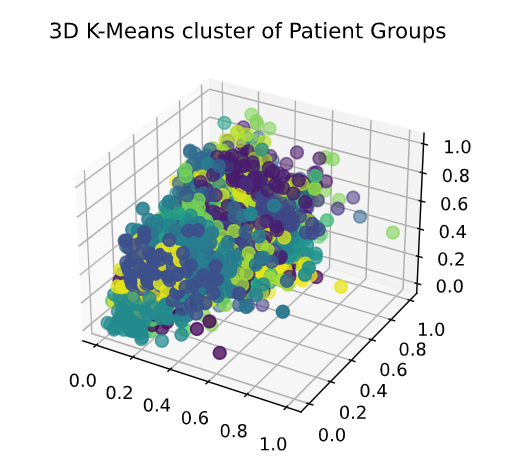

# PanPals - Clustering Patients Into Support Groups
## Creating Patient Groups with Unsupervised Learning 
### Data Exploration
In the context of our chosen track, we decided to focus on patients that tested COVID-19 Postive. Hence we chose the Sytheia COVID-19 Specialized dataset from https://synthea.mitre.org/. 

The dataset consisted of synthetic patient details, medication records, prior and current health conditions, health coverage, medical bills and various medical observations. Pretty much everything a standard EMR would have record of. Hence, we felt it was a good starting point for building a scalable and interoperability with many providers. 

For building an unsupervised clustering algorithm that doesn't overfit and sets the ground for future work, we decided to focus on key data points: **patient details, exisiting conditions and medical observations/vitals**.

## Data Encoding
Encoding becomes challenging when your data is modeled for a relation database. Hence, the Syntheia COVID-19 dataset had to be processed to ensure we normalize each datapoint and provide a feature that wouldn't throw off our clustering.

### Encoding Categorical Data
- Categorical data like ethinicity, condition groups and hierarchical conditions were all encoded using binary/one hot encoding.
- Majority of the Numerical data was just scaled using standard scaling to avoid any   

### Heuristics - Ranking Conditions
-- To Be Comlpeted -- 

## Creating Clusters - Unsupervised K-Mean/K-Mediod
Once we had the data encoded, we decided to employ K means algorithm to create clusters of 50. We reasonsed that K means would do fairly well since it relies on the principle that the "cluster center" (the arithmetic mean of all the points belonging to the cluster) is closer to its own cluster center than to other cluster centers.

### Example of a Cluster 3 grouping. Only plotted features are shown.

| Condition_Rank | Relative_Distance | ... | Age  |
|----------------|-------------------|-----|------|
| 35.0           | 1109.0            |     | 21.0 |
| 23.0           | 1107.0            |     | 26.0 |
| 35.0           | 1106.0            |     | 35.0 |
| 28.0           | 1103.0            |     | 23.0 |
| ...            | ...               | ... | ...  |

### Conclusion
The groupings/clusters were fairly accurate, although they could be improved with further feature tuning and opting for K-Medoids algorithm that handles categorical data better.
Also limited variance from the synthetic data could have contributed to the clusters being so close to each other.

